# MochaGlass

A Catppuccin Mocha, glass style desktop environment for Windows, built on top of Komorebi (tiling window manager), YASB (status bar), Cava (audio visualizer), and Flow Launcher, with a custom native widget for monitoring connected serial boards, phones, and USB drives.


[](https://github.com/Hyacinthe-primus/Project_MochaGlass/stargazers)
[](https://github.com/Hyacinthe-primus/Project_MochaGlass/commits)
[](https://github.com/Hyacinthe-primus/Project_MochaGlass/releases)
[](https://github.com/Hyacinthe-primus/Project_MochaGlass/issues)
[](LICENSE.md)

---

## Table of Contents

- [Overview](#overview)
- [Preview](#preview)
  - [Desktop Overview](#desktop-overview)
  - [YASB Status Bar](#yasb-status-bar)
  - [Control Center](#control-center)
  - [App Launcher](#app-launcher)
  - [Tiling Window Manager](#tiling-window-manager)
  - [Wallpapers](#wallpapers)
- [Stack](#stack)
- [Prerequisites](#prerequisites)
- [Installation](#installation)
  - [1. Install the base tools](#1-install-the-base-tools)
  - [2. Get the config files](#2-get-the-config-files)
  - [3. Get device_status.exe](#3-get-device_statusexe)
  - [4. Set up Windows Terminal](#4-set-up-windows-terminal)
  - [5. Update the paths](#5-update-the-paths)
  - [6. Restart the bar](#6-restart-the-bar)
- [Building device_status from source](#building-device_status-from-source)
- [Troubleshooting](#troubleshooting)
- [Credits](#credits)
- [License](#license)

---

## Overview

MochaGlass is a full ricing setup for Windows that replaces the default shell chrome with a tiling workflow and a translucent, Catppuccin Mocha themed status bar. It combines:

- **Komorebi** for tiling window management, driven through **whkd** keybindings
- **YASB** (Yet Another Status Bar) for the top bar, widgets, control center and wallpaper picker
- **Cava** for the live audio visualizer embedded in the bar
- **Flow Launcher** as the application launcher
- A custom compiled widget, **device_status.exe**, that reports connected serial boards (ESP32, Arduino), phones, and USB drives directly inside the bar

Everything is themed consistently: same accent colors, same blur and rounded corner treatment, same icon font across the bar, the launcher, and the tiling overlays.

## Preview

### Desktop Overview

| | |
|---|---|
| 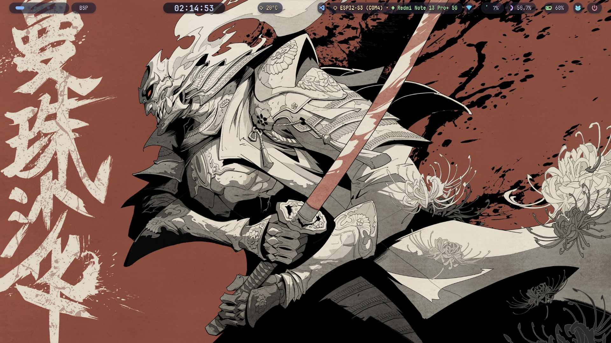 |  |

### YASB Status Bar

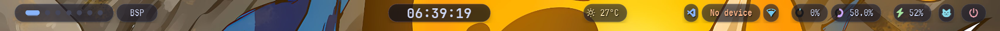

The bar shown above includes the workspace indicator, active window title, clock, weather, Cava visualizer, VS Code widget, the custom device status widget, wifi, CPU, memory, battery, wallpaper picker, and power menu.

### Control Center

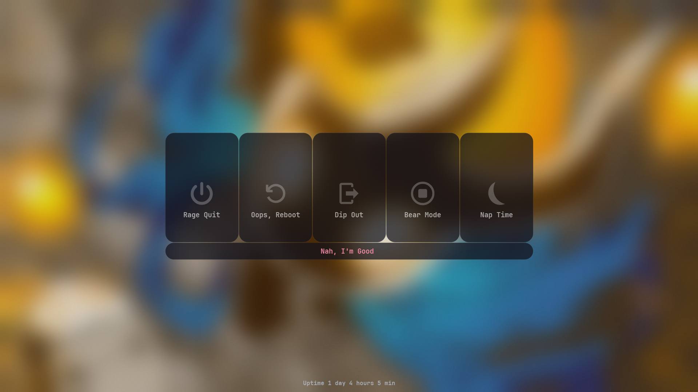

### App Launcher

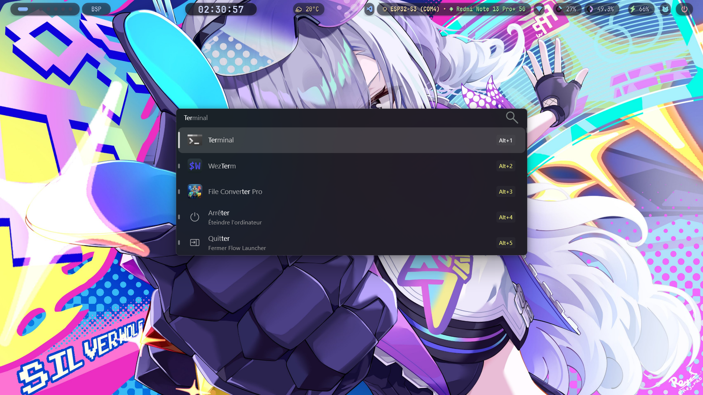

Flow Launcher is themed to match the rest of the setup and used as the primary app and file launcher.

### Tiling Window Manager

Komorebi in action across different layouts and wallpapers.

| | | |
|---|---|---|
| 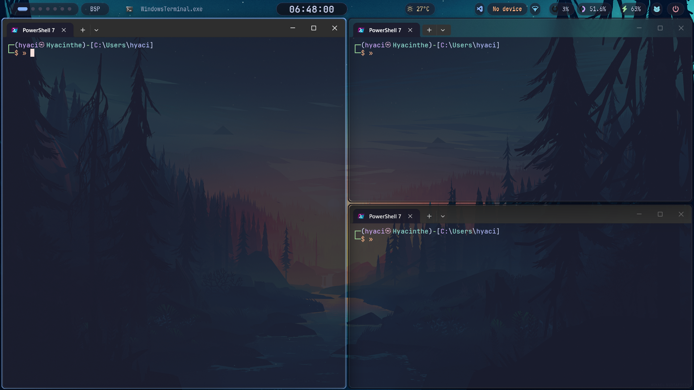 | 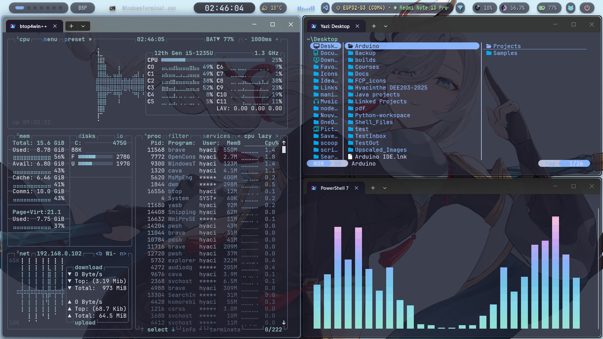 | 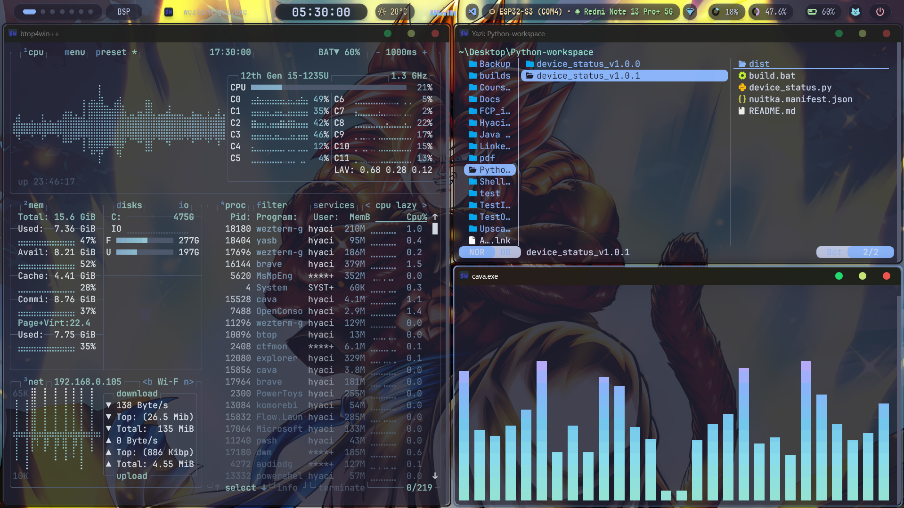 |

### Wallpapers

The set currently cycled by the `wallpapers` widget, stored in `Wallpapers/`.

| | | |
|---|---|---|
|  | 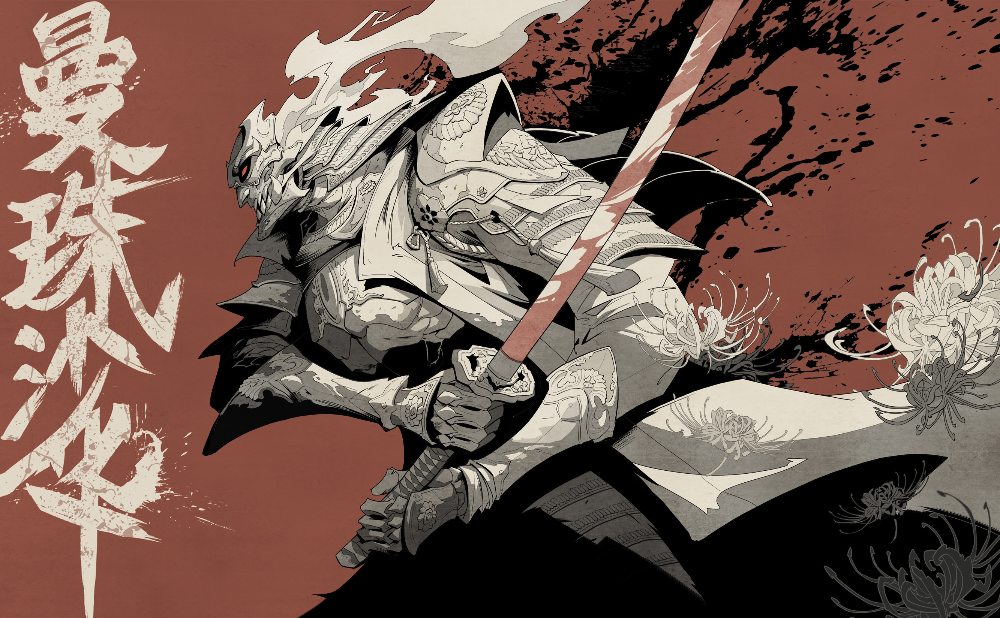 |  |
| Broken Vessel | Manjusaka | Shenhe |
|  |  | 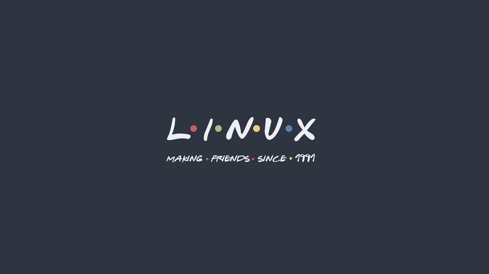 |
| Silver Wolf | Gogeta SSJ4 | Linux Friends |
| 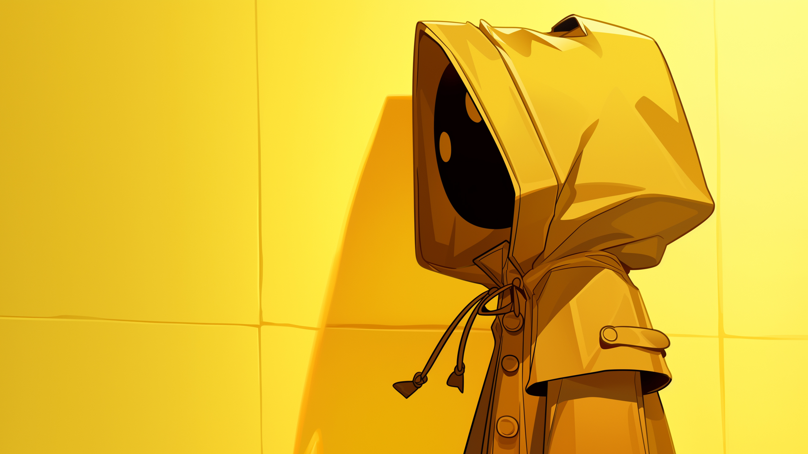 |  | 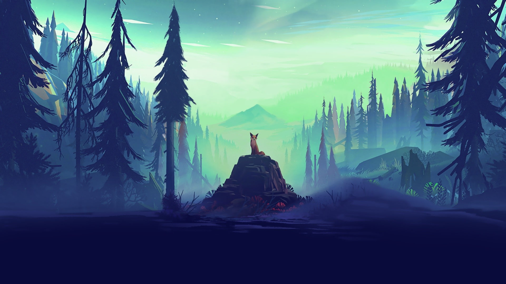 |
| Little Nightmares | Small Memory | Survey |

Drop your own images into `Wallpapers/` and point `wallpapers.image_path` at that folder (see [Update the paths](#5-update-the-paths)) to use them instead.

---

## Stack

| Component | Role | Repository |
|---|---|---|
| [Komorebi](https://github.com/LGUG2Z/komorebi) | Tiling window manager | LGUG2Z/komorebi |
| [whkd](https://github.com/LGUG2Z/whkd) | Hotkey daemon used to drive Komorebi | LGUG2Z/whkd |
| [YASB](https://github.com/amnweb/yasb) | Status bar, control center, wallpaper widget | amnweb/yasb |
| [Cava](https://github.com/karlstav/cava) | Console audio visualizer, piped into the bar | karlstav/cava |
| [Flow Launcher](https://github.com/Flow-Launcher/Flow-Launcher) | Application launcher | Flow-Launcher/Flow-Launcher |
| device_status.exe | Custom widget: serial boards, phones, USB drives | Included in this repo, `device_status_v1.0.0/` |
| Windows Terminal | Terminal, themed to match the rest of the setup | Included in this repo, `MochaGlass_Terminal/` |
| [JetBrainsMono Nerd Font Propo](https://github.com/ryanoasis/nerd-fonts) | Icon font used across the bar and launcher | ryanoasis/nerd-fonts |

---

## Prerequisites

- Windows 10 or Windows 11
- [Komorebi](https://github.com/LGUG2Z/komorebi) and [whkd](https://github.com/LGUG2Z/whkd) installed and on PATH
- [YASB](https://github.com/amnweb/yasb) installed
- [Cava](https://github.com/karlstav/cava) available for Windows (used by the `cava` widget)
- [Flow Launcher](https://www.flowlauncher.com/) installed
- [Windows Terminal](https://apps.microsoft.com/detail/9n0dx20hk701) installed (the tiling screenshots above all use it)
- **JetBrainsMono Nerd Font Propo** installed system wide (icons will render as boxes or blank glyphs otherwise)
- PowerShell available as `pwsh` or `powershell` (bundled with Windows by default, used internally by `device_status.exe`)
- A folder of wallpapers you own the rights to, for the wallpaper widget
- Only required if you rebuild `device_status.exe` yourself instead of using the release build: Python 3.10+, `pip install nuitka pyserial`

## Installation

### 1. Install the base tools

Install Komorebi, whkd, YASB, Cava, and Flow Launcher first, following each project's own setup instructions linked above. Confirm Komorebi starts correctly on its own before layering YASB on top of it.

Then get a copy of this repository:

```bash
git clone https://github.com/Hyacinthe-primus/Project_MochaGlass.git
```

### 2. Get the config files

You have two options.

**Option A: use the pre-built config archive (recommended)**

1. Go to the [Releases](https://github.com/Hyacinthe-primus/Project_MochaGlass/releases) page of this repository
2. Download `.config.zip`
3. Extract it directly into `C:\Users\<YourUsername>\`

This produces `C:\Users\<YourUsername>\.config\yasb\` and `C:\Users\<YourUsername>\.config\cava\`.

**Option B: use the raw templates**

Copy the contents of `MochaGlass_YASB/` into `C:\Users\<YourUsername>\.config\yasb\`, and the contents of `MochaGlass_Cava/` into `C:\Users\<YourUsername>\.config\cava\`. This is the same content as `.config.zip`, but as plain files instead of an archive, useful if you want to diff or version your own changes before deploying them.

### 3. Get device_status.exe

1. Go to the [Releases](https://github.com/Hyacinthe-primus/Project_MochaGlass/releases) page of this repository
2. Download `device_status.dist.zip`
3. Extract it into `C:\Users\<YourUsername>\scripts\`

This produces `C:\Users\<YourUsername>\scripts\device_status.dist\device_status.exe`. Do not point YASB at a standalone `.exe` outside that folder: this is a Nuitka standalone build, and the `.exe` depends on the other files sitting next to it inside `device_status.dist\`.

### 4. Set up Windows Terminal

The Windows Terminal settings in `MochaGlass_Terminal/settings.json` add the Catppuccin Mocha color scheme, the JetBrainsMono Nerd Font, and the acrylic/padding look used in every screenshot above. It only ships with profiles that exist on a stock Windows install (Windows PowerShell, Command Prompt, PowerShell 7, Azure Cloud Shell, Visual Studio, WSL/Ubuntu), nothing hardcoded to a specific machine or username.

1. Open Windows Terminal, then Settings, then click **Open JSON file** (or press `Ctrl+Shift+,`) to find your own `settings.json`, usually at:
   ```
   %LOCALAPPDATA%\Packages\Microsoft.WindowsTerminal_8wekyb3d8bbwe\LocalState\settings.json
   ```
2. Back up that file if you already have custom profiles in it
3. Replace its contents with `MochaGlass_Terminal/settings.json` from this repo, or merge the `schemes`, `profiles.defaults`, `actions`, and `keybindings` blocks into your existing file
4. If PowerShell 7 is not installed at `C:\Program Files\PowerShell\7\pwsh.exe` on your machine, update or remove that profile's `commandline` and `icon` paths, or just delete that profile and let Windows Terminal fall back to Windows PowerShell

**Optional: ESP-IDF profile.** If you use ESP-IDF and want a dedicated profile for it, add an entry like this to `profiles.list`, adjusting the paths to where ESP-IDF and its PowerShell profile script are actually installed on your machine:

```json
{
    "commandline": "powershell.exe -NoExit -ExecutionPolicy Bypass -NoProfile -Command \"& {. 'C:\\Path\\To\\Espressif\\tools\\Microsoft.vX.X.PowerShell_profile.ps1' }\"",
    "guid": "{915cb41c-09ee-4ec9-915c-09ee915cb41c}",
    "hidden": false,
    "icon": "C:\\Path\\To\\Your\\Icon.ico",
    "name": "ESP-IDF",
    "startingDirectory": "%USERPROFILE%\\Desktop"
}
```

This is left out of the shipped `settings.json` on purpose since not everyone has ESP-IDF installed, and the original version hardcoded one specific username and tool path.

### 5. Update the paths

Open `C:\Users\<YourUsername>\.config\yasb\config.yaml` and replace the placeholder paths with your real ones:

| Setting | Placeholder in the repo | Replace with |
|---|---|---|
| `board_status.exec_options.run_cmd` | `C:\\Users\\Username\\scripts\\device_status.dist\\device_status.exe` | `C:\\Users\\<YourUsername>\\scripts\\device_status.dist\\device_status.exe` |
| `wallpapers.image_path` | `C:/Users/Username/Pictures/Wallpapers` | The real path to your own wallpaper folder |

Both paths use backslashes for the executable and forward slashes for the wallpaper folder. Keep the same slash style when you edit them, YAML strings here are passed through as is.

### 6. Restart the bar

`watch_config` and `watch_stylesheet` are enabled, so YASB should pick up the change automatically. If it does not, restart YASB (and Komorebi, if you also changed anything Komorebi related) from the tray icon or by relaunching it.

---

## Building device_status from source

Only needed if you want to modify `device_status.py` yourself instead of using the release build.

```bat
cd device_status_v1.0.0
pip install nuitka pyserial
build.bat
```

`build.bat` reads the version from `nuitka.manifest.json`, then runs Nuitka in standalone (folder) mode, not `--onefile`. The finished build lands at:

```
device_status_v1.0.0\dist\device_status.dist\device_status.exe
```

Copy that whole `device_status.dist` folder to wherever `run_cmd` in `config.yaml` points, then repackage it as `device_status.dist.zip` if you intend to publish it as a release.

---

## Troubleshooting

- **Icons show up as boxes or missing glyphs**: JetBrainsMono Nerd Font Propo is not installed, or not set as the default in your terminal/DPI scaling. Reinstall the font and restart YASB.
- **`board_status` widget always shows "No device"**: the path in `run_cmd` does not match where you actually extracted `device_status.dist.zip`, or the executable was moved without its sibling files.
- **Windows flags `device_status.exe` as unrecognized (SmartScreen)**: expected for an unsigned, freshly compiled Nuitka binary. Either build it yourself from `device_status.py`, or allow it manually if you trust the release.
- **Power menu or CPU/memory icons look wrong on Windows 10**: those widgets rely on `Segoe Fluent Icons`, which ships with Windows 11. On Windows 10 they may fall back to a different glyph set.
- **Cava widget shows nothing**: confirm Cava itself is running and outputting to the source YASB expects; the `cava` widget in `config.yaml` only renders what Cava feeds it.
- **Blur/glass effect not visible**: transparency and blur effects depend on Windows' own DWM settings; confirm transparency effects are enabled in Windows Settings > Personalization > Colors.

## Credits

- [Komorebi](https://github.com/LGUG2Z/komorebi) and [whkd](https://github.com/LGUG2Z/whkd) by LGUG2Z
- [YASB](https://github.com/AmN1988/yasb)
- [Cava](https://github.com/karlstav/cava) by karlstav
- [Flow Launcher](https://github.com/Flow-Launcher/Flow-Launcher)
- [Catppuccin](https://github.com/catppuccin/catppuccin) for the Mocha color palette
- [Nerd Fonts](https://github.com/ryanoasis/nerd-fonts) for JetBrainsMono NFP

## License

Licensed under the [MIT License](LICENSE.md).
